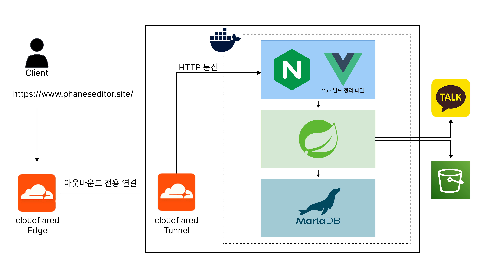
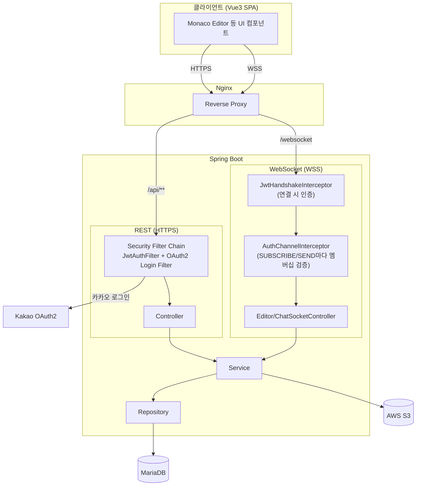
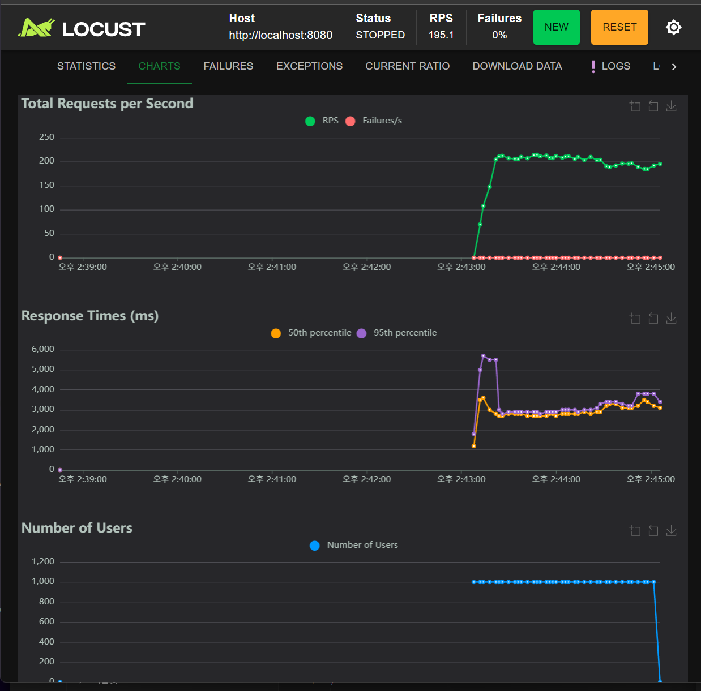
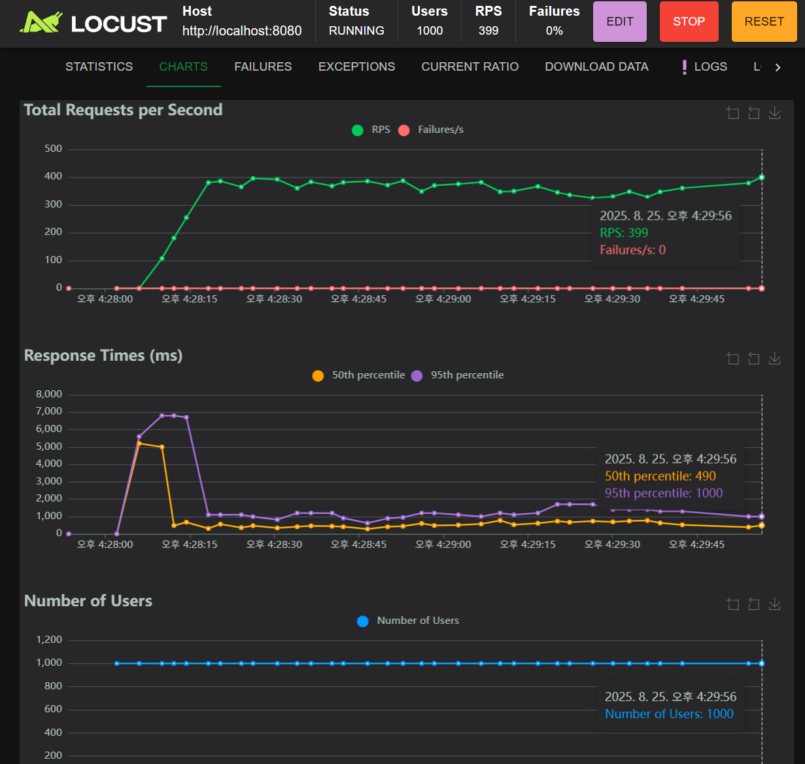
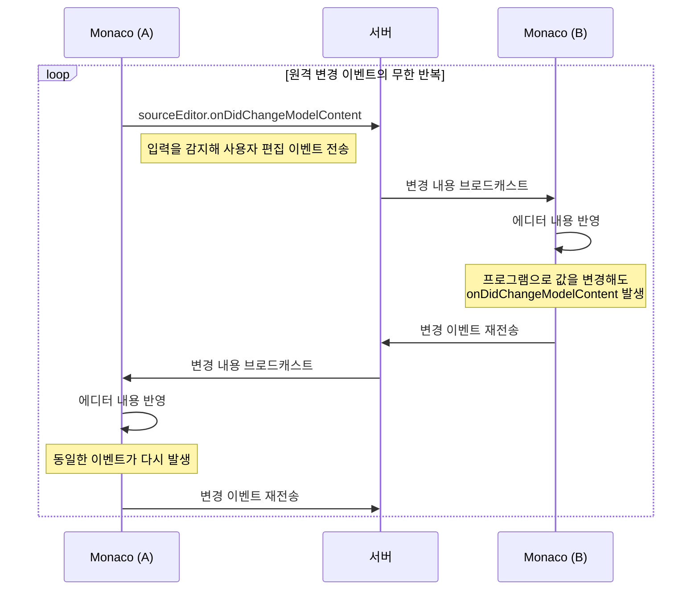
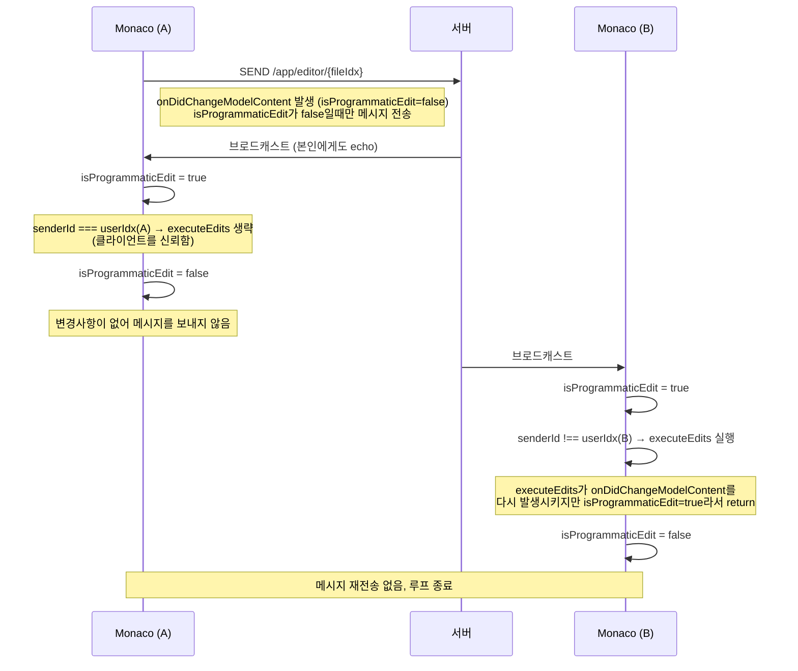

# PhanesEditor Backend Project


## 1. 프로젝트 소개

> Phanes Editor는 Spring Boot와 Vue3를 기반으로 개발한 실시간 협업 코드 에디터입니다.

> WebSocket과 STOMP를 이용한 실시간 코드 동기화와 JWT 기반 인증을 통해 여러 사용자가 하나의 프로젝트에서 함께 개발할 수 있는 환경을 제공합니다.

### 링크
[PhanesEditor 바로가기](https://www.phaneseditor.site/)

테스트 아이디
ID: test
PASSWORD: 1234

## 2. 프로젝트 정보

| 항목           | 내용                                        |
|----------------|-------------------------------------------|
| 개발 기간      | 2025-06-18 ~ 2025-09-23                   |
| 개발 인원      | 2명                                        |
| 담당 역할      | Backend, Frontend, Infra                  |
| 주요 기술 스택 | Spring Boot, Vue3, MariaDB, Docker, Nginx |

## 3. 주요 기능

### 👥 프로젝트 협업

- 프로젝트 생성 및 관리
- 프로젝트 멤버 초대 및 참여
- 프로젝트별 독립적인 작업 공간 제공

### 💻 실시간 코드 편집

- 여러 사용자가 동시에 코드 편집
- 변경 사항을 실시간으로 동기화
- 프로젝트 참여자에게 즉시 반영
- WebSocket 기반 실시간 통신

### 🔐 사용자 인증

- JWT 기반 로그인 및 인증
- 인증된 사용자만 프로젝트 접근 가능

### 📂 파일 관리

- 파일 및 디렉터리 생성
- 파일 수정 및 저장
- 프로젝트 구조 관리

## 4. 기술 스택

### frontend


### Backend


### infra


## 5. 아키텍처
### 배포 환경

처음에는 AWS + Kubernetes(+ RDS)로 배포했지만, AWS 프리티어가 종료되고 프로젝트도 사실상 혼자 운영하는 규모로 줄어들면서, 이 정도 스케일에 쿠버네티스 클러스터를 유지하는 비용과 운영 복잡도가 맞지 않다고 판단해 Cloudflare Tunnel + Docker로 전환했습니다. 별도의 인증서 발급이나 포트포워딩 없이 빠르게 HTTPS 서비스를 운영할 수 있었고, 비용도 들지 않았습니다

### 시스템 아키텍처


REST와 WebSocket 두 채널 모두 각자의 인증 관문(Security Filter Chain / Handshake·Channel Interceptor)을 통과해야만 실제 비즈니스 로직(Service)에 도달합니다.

## 6. 트러블 슈팅

### 6-1. 프로젝트 상세 조회 N+1 문제

#### 문제

프로젝트 상세 조회 API에서 Project, File, ProjectMember, User 정보를 각각 조회하면서 Hibernate의 LAZY Loading과 BatchSize에 의해 여러 개의 추가 SQL이
발생하였다.

특히 프로젝트 참여자가 많아질수록 IN (...) 형태의 조회가 반복되어 응답 속도가 크게 저하되었다.

#### 원인 분석

기존에는 Project > Files > ProjectMember > User > ••• Chat

Project 조회 후 연관 엔티티를 LAZY Loading으로 조회하면서 추가 SQL이 반복 실행되었다.

@BatchSize는 N+1 문제를 일부 완화했지만 추가 SQL 자체는 제거하지 못했다.

#### 해결

```java
@Query("""
        SELECT p
        FROM Project p
        LEFT JOIN FETCH p.fileList
        WHERE p.idx = :idx
        """)
Optional<Project> findByProjectIdx(Integer idx);
```

프로젝트와 파일을 한 번의 SQL로 조회하도록 변경하였다.

ProjectMember 부분 또한
프로젝트 멤버 조회 시 사용자 정보(닉네임, 프로필 등)가 항상 함께 사용되므로, User 엔티티를 즉시 조회하도록 변경하여 추가 SQL이 발생하지 않도록 개선하였다.

#### 결과

<p align="center">
  
  
</p>

| 항목      |   개선 전 |  개선 후 |
|---------|-------:|------:|
| 평균 응답시간 | 2963ms | 754ms |
| RPS     |    195 |   381 |
| SQL 호출  |     다수 |    3회 |

### 6-2. 웹소켓 실시간 편집 무한 메시지 전달

#### 문제

Monaco 에디터에서 한 사용자가 코드를 수정하면 다른 사용자의 화면에도 반영되도록 변경 사항을 WebSocket으로 브로드캐스트한다. 그런데 수신 측이 받은 내용을
자신의 에디터에 반영하는 순간, 다시 그 변경이 서버로 전송되고 이것이 상대방에게 재전송되는 일이 반복되며 메시지가 끊임없이 오갔다.

#### 원인 분석

Monaco의 `onDidChangeModelContent` 이벤트는 사용자가 직접 타이핑해서 발생한 변경과, `executeEdits`/`setValue`로 프로그램이 반영한 변경을 구분하지 않는다.
그래서 원격 변경을 내 에디터에 반영하는 순간에도 동일한 이벤트가 발생해 다시 서버로 전송되었다.



#### 해결

원격 변경을 반영하는 동안에만 켜지는 플래그(`isProgrammaticEdit`)로 그 구간에서 발생하는 이벤트를 무시하도록 했다. 또한 서버가 발신자에게도 그대로
메시지를 되돌려주기 때문에(echo), 메시지의 `senderId`가 자기 자신이면 애초에 반영 자체를 하지 않도록 분리했다.

```js
sourceEditor.onDidChangeModelContent((event) => {
    if (isProgrammaticEdit) return
    event.changes.forEach(change => {
        sendMessage({senderId: userIdx, text: change.text, range: change.range, type: 'nomal'})
    })
})

socket.value.subscribe(`/topic/editor/${fileIdx}`, msg => {
    const code = JSON.parse(msg.body)
    isProgrammaticEdit = true
    if (code.type === 'save') {
        sourceEditor.setValue(code.text)
    } else if (userIdx != code.senderId) {
        sourceEditor.executeEdits('remote-edit', [{range: toMonacoRange(code.range), text: code.text}])
    }
    isProgrammaticEdit = false
})
```



`isProgrammaticEdit`는 반영 중 발생하는 이벤트로 인한 재전송을 막고, `senderId` 비교는 애초에 그 메시지를 반영할지 말지를 결정한다. 두 장치가 각각 다른
문제(무한 루프 방지 / 자기 자신 재적용 방지)를 담당한다.

> 현재는 두 사람이 같은 범위를 거의 동시에 편집하는 충돌 상황까지는 다루지 않는다. 이 부분은 OT/CRDT 기반 해결이 필요하며 향후 개선 사항으로 남겨두었다.

## 7. 향후 개선 사항

- OT/CRDT 기반 충돌 해결
- 코드 실행기능
- 코드 변경 이력
- 권한 관리

[//]: # (GIF로 두개의 화면중 한개의 화면에서 로그인 프로젝트 생성 후 서로 웹소켓으로 통신되는 모습을 보여주면 됨)
[//]: # (배포 후 링크까지 걸어줘야 완성임 테스트 계정도 넣어주고)